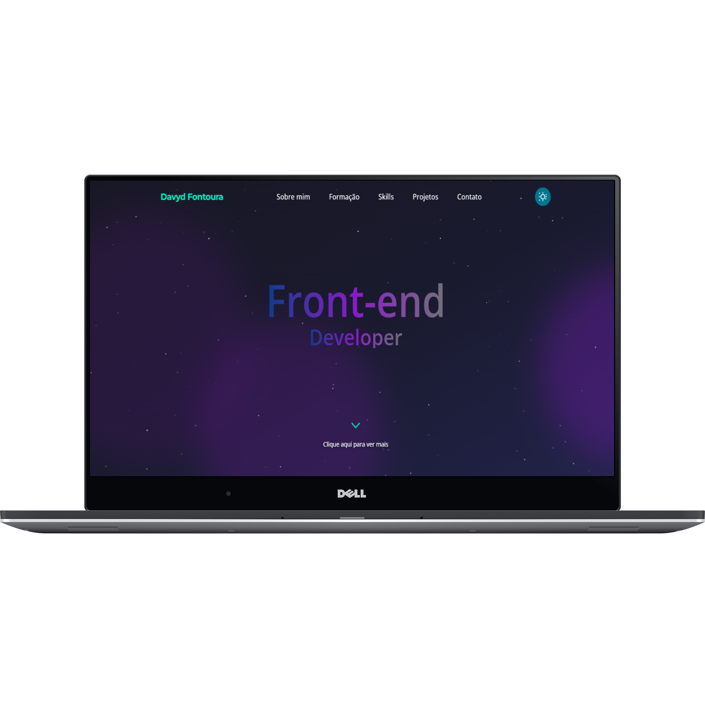
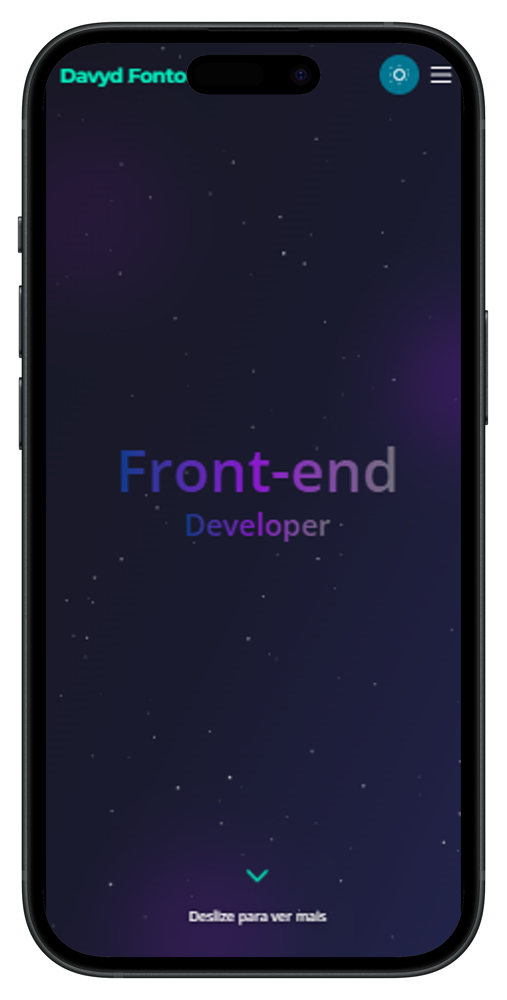

# Portfólio Website - v1.0

Este é o meu website portfólio, desenvolvido com HTML, Tailwind CSS e JavaScript.

  <a href="https://davydportfoliowebsite.vercel.app/" target="_blank">
    
      
      
    

    <strong style="font-size:2em; color:#2563eb; background:#e0e7ff; padding:0.5em 1em; border-radius:8px; display:inline-block;">
        CLIQUE PARA VISUALIZAR!
    </strong>
    

  </a>

## Estrutura do Projeto
- `index.html`: Página principal do portfólio.
- `css/styles.css`: Arquivo de estilos personalizados.
- `js/scripts.js`: Arquivo de scripts JavaScript.
- `images/`: Pasta com imagens utilizadas no site.

## Tecnologias Utilizadas
- HTML
- Tailwind CSS
- JavaScript
